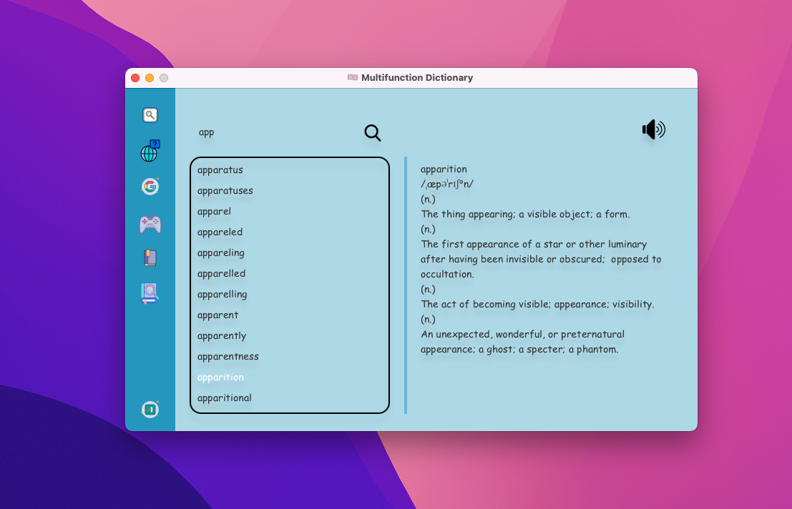

# OOP-Project: Dictionary

BTL môn Lập trình hướng đối tượng INT2204_20 - UET 

## Table of Contents

- [Authors](#authors)
- [Installation](#installation)
- [About](#about)
- [Features](#features)
- [UML](#uml)
- [Technologies](#technologies)

## Authors

| Full Name          | GitHub Profile                       |
|:-------------------|:-------------------------------------|
| Lê Tuấn Kiệt       | <https://github.com/LTK-Dev>         |
| Hoàng Bảo Long     | <https://github.com/leo-090804>      |
| Nguyễn Đức Mạnh    | <https://github.com/Nguyen-DucManh>  |

## Installation  
1. Tải và cài đặt [Intellij](https://www.jetbrains.com/idea/download) hoặc bất kỳ IDE nào tương tự.
2. Tải hoặc clone project: `git clone [link to the project]`.
3. Tải và cài đặt [JavaFX](https://openjfx.io/openjfx-docs) theo hướng dẫn cài đặt.
4. Mở Project trong Intellij và set up JVM:

`Run` -> `Edit Configurations` -> `Add new run configuration` 
 Main class: `Start.Start`

`Modify options` -> `Add VM options` -> VM options: 
- Window: --module-path "\path\to\javafx-sdk-21.0.1\lib" --add-modules javafx.controls,javafx.fxml
- MacOS/Linux: --module-path /path/to/javafx-sdk-21.0.1/lib --add-modules javafx.controls,javafx.fxml

5. Ấn run để chạy game.

## About 

 Từ điển là một ứng dụng đơn giản nhưng hữu ích được thiết kế để giúp bạn tra cứu các từ vựng và cung cấp các định nghĩa, ví dụ và thông tin liên quan khác. Với giao diện thân thiện và dễ sử dụng, Từ điển là người bạn đồng hành đáng tin cậy cho việc nâng cao vốn từ vựng và hiểu biết của bạn.

## Features

1. Tra từ offline cùng với audio từ database có sẵn: 

2. Tra phrasal verb offline từ database cùng với audio hỗ trợ cho học tiếng anh nâng cao: 

3. Dịch văn bản với audio thông qua Google API:

4. Tra từ với audio online thông qua API:

5. Một Bookmark cho phép người dùng tự thêm, lưu và xoá từ vào database:

6. Game Wordle để giải trí hỗ trợ học tập Tiếng Anh:

## UML 

## Technologies
- IntelliJ  
- Scene Builder 
- Java SDK
- JavaFX 
- CSS
- FreeTTS Library
- Json Library
- SQLite JDBC Library
- Jlayer Library
- Google Cloud Translate Library
- Java Google Speech API Library

